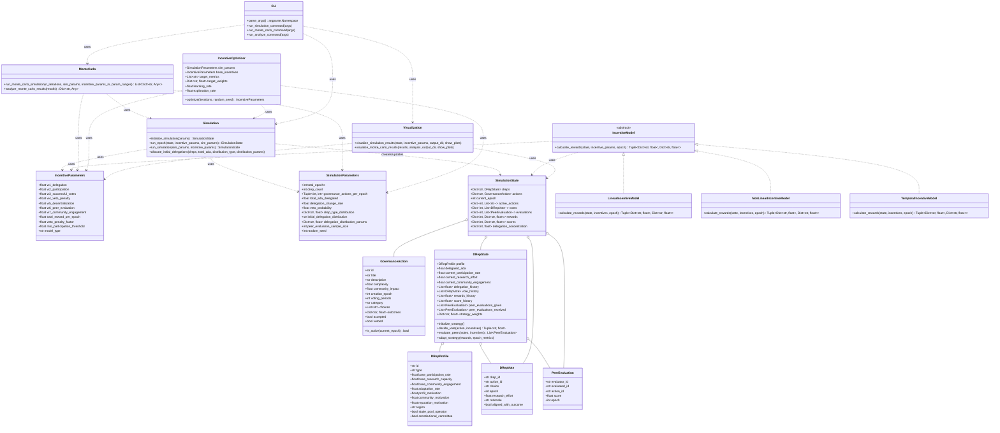

```mermaid
classDiagram
    %% Core data models
    class GovernanceAction {
        +str id
        +str title
        +str description
        +float complexity
        +float community_impact
        +int creation_epoch
        +int voting_periods
        +str category
        +List~str~ choices
        +Dict~str, float~ outcomes
        +bool accepted
        +bool vetoed
        +is_active(current_epoch) bool
    }
    
    class DRepVote {
        +str drep_id
        +str action_id
        +str choice
        +int epoch
        +float research_effort
        +str rationale
        +bool aligned_with_outcome
    }
    
    class PeerEvaluation {
        +str evaluator_id
        +str evaluated_id
        +str action_id
        +float score
        +int epoch
    }
    
    class DRepProfile {
        +str id
        +str type
        +float base_participation_rate
        +float base_research_capacity
        +float base_community_engagement
        +float adaptation_rate
        +float profit_motivation
        +float community_motivation
        +float reputation_motivation
        +str region
        +bool stake_pool_operator
        +bool constitutional_committee
    }
    
    class DRepState {
        +DRepProfile profile
        +float delegated_ada
        +float current_participation_rate
        +float current_research_effort
        +float current_community_engagement
        +List~float~ delegation_history
        +List~DRepVote~ vote_history
        +List~float~ rewards_history
        +List~float~ score_history
        +List~PeerEvaluation~ peer_evaluations_given
        +List~PeerEvaluation~ peer_evaluations_received
        +Dict~str, float~ strategy_weights
        +initialize_strategy()
        +decide_vote(action, incentives) Tuple~str, float~
        +evaluate_peers(votes, incentives) List~PeerEvaluation~
        +adapt_strategy(rewards, epoch_metrics)
    }
    
    class IncentiveParameters {
        +float w1_delegation
        +float w2_participation
        +float w3_successful_votes
        +float w4_veto_penalty
        +float w5_decentralization
        +float w6_peer_evaluation
        +float w7_community_engagement
        +float total_reward_per_epoch
        +float veto_penalty_factor
        +float min_participation_threshold
        +str model_type
    }
    
    class SimulationParameters {
        +int total_epochs
        +int drep_count
        +Tuple~int, int~ governance_actions_per_epoch
        +float total_ada_delegated
        +float delegation_change_rate
        +float veto_probability
        +Dict~str, float~ drep_type_distribution
        +str initial_delegation_distribution
        +Dict~str, float~ delegation_distribution_params
        +int peer_evaluation_sample_size
        +int random_seed
    }
    
    class SimulationState {
        +Dict~str, DRepState~ dreps
        +Dict~str, GovernanceAction~ actions
        +int current_epoch
        +Dict~int, List~str~~ active_actions
        +Dict~int, List~DRepVote~~ votes
        +Dict~int, List~PeerEvaluation~~ evaluations
        +Dict~int, Dict~str, float~~ rewards
        +Dict~int, Dict~str, float~~ scores
        +Dict~int, float~ delegation_concentration
    }
    
    %% Simulation engine
    class Simulation {
        +initialize_simulation(params) SimulationState
        +run_epoch(state, incentive_params, sim_params) SimulationState
        +run_simulation(sim_params, incentive_params) SimulationState
        +allocate_initial_delegations(dreps, total_ada, distribution_type, distribution_params)
    }
    
    %% Incentive Models
    class IncentiveModel {
        <<abstract>>
        +calculate_rewards(state, incentive_params, epoch) Tuple~Dict~str, float~, Dict~str, float~~
    }
    
    class LinearIncentiveModel {
        +calculate_rewards(state, incentives, epoch) Tuple~Dict~str, float~, Dict~str, float~~
    }
    
    class NonLinearIncentiveModel {
        +calculate_rewards(state, incentives, epoch) Tuple~Dict~str, float~, Dict~str, float~~
    }
    
    class TemporalIncentiveModel {
        +calculate_rewards(state, incentives, epoch) Tuple~Dict~str, float~, Dict~str, float~~
    }
    
    %% Analysis tools
    class MonteCarlo {
        +run_monte_carlo_simulation(n_iterations, sim_params, incentive_params_in, param_ranges) List~Dict~str, Any~~
        +analyze_monte_carlo_results(results) Dict~str, Any~
    }
    
    class IncentiveOptimizer {
        +SimulationParameters sim_params
        +IncentiveParameters base_incentives
        +List~str~ target_metrics
        +Dict~str, float~ target_weights
        +float learning_rate
        +float exploration_rate
        +optimize(iterations, random_seed) IncentiveParameters
    }
    
    %% Visualization
    class Visualization {
        +visualize_simulation_results(state, incentive_params, output_dir, show_plots)
        +visualize_monte_carlo_results(results, analysis, output_dir, show_plots)
    }
    
    %% CLI
    class CLI {
        +parse_args() argparse.Namespace
        +run_simulation_command(args)
        +run_monte_carlo_command(args)
        +run_analyze_command(args)
    }
    
    %% Relationships
    DRepState o-- DRepProfile
    DRepState o-- DRepVote
    DRepState o-- PeerEvaluation
    SimulationState o-- DRepState
    SimulationState o-- GovernanceAction
    SimulationState o-- DRepVote
    SimulationState o-- PeerEvaluation
    
    Simulation ..> SimulationState : creates/updates
    Simulation ..> SimulationParameters : uses
    Simulation ..> IncentiveParameters : uses
    
    IncentiveModel <|.. LinearIncentiveModel
    IncentiveModel <|.. NonLinearIncentiveModel
    IncentiveModel <|.. TemporalIncentiveModel
    
    IncentiveModel ..> SimulationState : uses
    IncentiveModel ..> IncentiveParameters : uses
    
    MonteCarlo ..> Simulation : uses
    MonteCarlo ..> SimulationParameters : uses
    MonteCarlo ..> IncentiveParameters : uses
    
    IncentiveOptimizer ..> Simulation : uses
    IncentiveOptimizer ..> SimulationParameters : uses
    IncentiveOptimizer ..> IncentiveParameters : uses
    
    Visualization ..> SimulationState : uses
    Visualization ..> IncentiveParameters : uses
    
    CLI ..> Simulation : uses
    CLI ..> MonteCarlo : uses
    CLI ..> Visualization : uses
```    